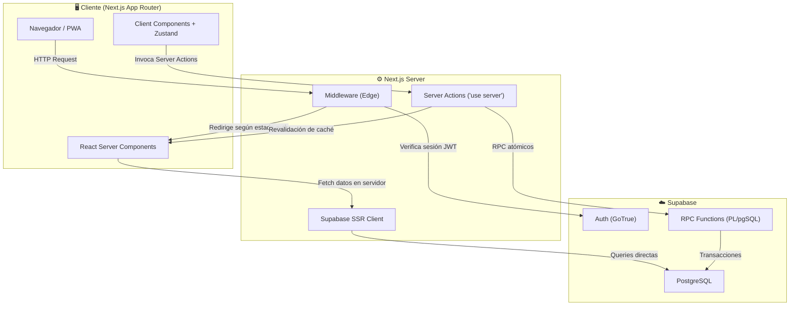

# 📄 Las Pipzhas POS — Documentación Técnica

> Sistema de Punto de Venta (POS) y Orquestador de Inventarios para **Las Pipzhas Pizzería**.
> Construido con Next.js 16, React 19, Supabase (PostgreSQL + Auth) y Zustand.

---

## 📑 Índice de Documentación

| Archivo | Contenido |
|---|---|
| [README.md](./README.md) | Este archivo. Visión general, arquitectura de alto nivel y guía de setup local. |
| [architecture.md](./architecture.md) | Flujo de datos, manejo de estado, integraciones con Supabase y diagramas de secuencia. |
| [database.md](./database.md) | Diccionario de datos exhaustivo, ERD, relaciones y políticas RLS. |
| [api_and_functions.md](./api_and_functions.md) | Documentación de Server Actions, funciones RPC y llamadas críticas a la base de datos. |
| [deployment.md](./deployment.md) | Guía de despliegue, variables de entorno e infraestructura. |

---

## 🍕 Visión del Producto

**Las Pipzhas POS** es una aplicación web progresiva (PWA) diseñada específicamente para una pizzería colombiana. Cubre tres pilares funcionales:

1. **Punto de Venta (POS):** Interfaz de caja para configurar pizzas (completas o por mitades), aplicar descuentos por ítem, seleccionar canal de venta (Propio / Rappi / DiDi) y procesar ventas atómicamente.
2. **Gestión de Inventario:** Control de stock en tiempo real con alertas de re-abastecimiento, historial de movimientos (ventas, mermas, compras, ajustes), y deducción automática de ingredientes basada en recetas configurables.
3. **Analítica de Ventas:** Dashboard con reportes financieros, comparativas por canal de venta y evolución temporal de ingresos.

### Características Clave

- **Procesamiento atómico de ventas** vía funciones PL/pgSQL (`SECURITY DEFINER`) que garantizan integridad transaccional en la deducción de inventario.
- **Arquitectura pizza-as-a-recipe**: Cada sabor de pizza se compone de ingredientes vinculados por tabla pivot. Las porciones se definen por tamaño de pizza, permitiendo deducción granular de inventario.
- **Soporte mitad-y-mitad**: Lógica de deducción fraccionada donde cada mitad descuenta solo el 50% de la porción de sus ingredientes.
- **PWA completa**: Service Worker con estrategia Network-First, manifest.json con shortcuts, página offline y soporte de instalación nativa.
- **Mobile-first con App Shell responsivo**: Sidebar en desktop, FAB flotante con portal en móvil, gestos de swipe para el carrito.

---

## 🏗️ Arquitectura de Alto Nivel



### Stack Tecnológico

| Capa | Tecnología | Versión | Propósito |
|---|---|---|---|
| **Framework** | Next.js (App Router) | ^16.2.2 | SSR, RSC, routing, middleware |
| **UI** | React | ^19.2.4 | Componentes de interfaz |
| **Estilos** | Tailwind CSS | ^4.2.2 | Utility-first CSS |
| **Estado** | Zustand | ^5.0.12 | Estado global del carrito POS |
| **BaaS** | Supabase | ^2.101.1 | PostgreSQL, Auth, RPC |
| **Animaciones** | Framer Motion | ^12.38.0 | Animaciones de UI (declarada, uso mínimo) |
| **Gráficas** | Recharts | ^3.8.1 | Gráficos del dashboard de reportes |
| **Notificaciones** | Sonner | ^2.0.7 | Toast notifications |
| **Iconos** | Lucide React | ^1.7.0 | Librería de iconos SVG |
| **TypeScript** | TypeScript | ^6.0.2 | Type safety |

---

## 📁 Estructura del Proyecto

```
pipzhaspos/
├── public/
│   ├── icons/               # Iconos PWA (72x72 a 512x512)
│   ├── manifest.json        # Web App Manifest
│   ├── sw.js                # Service Worker (Network-First)
│   └── offline.html         # Página de fallback offline
├── src/
│   ├── app/
│   │   ├── globals.css      # Estilos base (Tailwind)
│   │   ├── layout.tsx       # Root Layout (PWA meta, Toaster, SW register)
│   │   ├── page.tsx         # Root "/" → redirect a /login
│   │   ├── (auth)/
│   │   │   └── login/
│   │   │       └── page.tsx # Pantalla de login (Client Component)
│   │   └── (dashboard)/
│   │       ├── layout.tsx   # Dashboard shell (NavigationShell + CartSidebar + MasterFAB)
│   │       ├── loading.tsx  # Skeleton de carga (Suspense)
│   │       ├── pos/         # Caja POS — configurador de pizzas
│   │       ├── inventario/  # Maestro de insumos — tabla con modales CRUD
│   │       ├── ventas/      # Historial de ventas — lista con desglose
│   │       ├── sabores/     # Recetas de sabores — CRUD de composición
│   │       ├── raciones/    # Gramajes por tamaño — grilla editable
│   │       ├── reportes/    # Dashboard de analítica financiera
│   │       └── alertas/     # Dashboard de alertas de stock bajo
│   ├── components/
│   │   ├── layout/          # Shell de navegación, FAB, MobileCartHandle, PWA, Settings
│   │   ├── pos/             # MenuDisplay, PizzaConfigBottomSheet, CartSidebar, CartToggle
│   │   ├── inventory/       # InventoryManager, AdjustmentModal
│   │   ├── ventas/          # VentasList
│   │   ├── reportes/        # ReportesDashboard
│   │   ├── sabores/         # SaboresManager
│   │   └── raciones/        # RacionesEditor
│   ├── lib/
│   │   ├── supabase/
│   │   │   ├── client.ts    # createBrowserClient (Client Components)
│   │   │   └── server.ts    # createServerClient (Server Components + Actions)
│   │   └── utils.ts         # Utilidades (formatCOP)
│   ├── server/
│   │   └── actions/
│   │       ├── auth.ts      # loginUser
│   │       ├── orders.ts    # processSale
│   │       ├── ventas.ts    # getVentas, deleteVenta, editarOrigenVenta, agregarItemsAVenta
│   │       ├── inventory.ts # adjustInventoryStock, createIngredient, desactivarIngrediente, etc.
│   │       ├── adjustments.ts # adjustStock (módulo alternativo de ajustes)
│   │       ├── recipes.ts   # getSaboresConIngredientes, crearSabor, vincular/desvincular
│   │       └── raciones.ts  # getRacionesData, updateRecetaTopping, batch saves
│   ├── store/
│   │   └── usePosStore.ts   # Zustand store (cart, origen, PWA prompt, selectores)
│   ├── types/
│   │   └── pos.types.ts     # Tipos legacy (parcialmente reemplazados por el store)
│   └── middleware.ts        # Auth middleware (Edge Runtime)
├── supabase/
│   ├── rpc_procesar_venta.sql   # RPC original (v1, sin tabla ventas)
│   ├── 01_historial_ventas.sql  # Migración: tabla ventas + RPC v2 + revertir_venta
│   ├── 02_fix_revertir_venta.sql # Parche: fix constraint en tipo_movimiento
│   ├── 03_fix_procesar_venta.sql # Parche: lógica completa vs mitades en deducción
│   ├── seed.sql                  # Seed inicial (7 ingredientes, 1 tamaño)
│   └── seed_v2.sql               # Seed completo (17 ingredientes, 3 tamaños, recetas)
├── .env.local               # Variables de entorno (Supabase URL + ANON KEY)
├── package.json
├── tsconfig.json
└── next-env.d.ts
```

---

## 🚀 Guía de Configuración Local (Setup)

### Prerrequisitos

- **Node.js** ≥ 20.x
- **npm** ≥ 10.x (o pnpm / yarn)
- **Cuenta de Supabase** con un proyecto configurado

### Paso 1: Clonar el Repositorio

```bash
git clone <url-del-repositorio>
cd pipzhaspos
```

### Paso 2: Instalar Dependencias

```bash
npm install
```

### Paso 3: Configurar Variables de Entorno

Crear un archivo `.env.local` en la raíz del proyecto con las siguientes variables:

```env
# Supabase — Credenciales del proyecto
NEXT_PUBLIC_SUPABASE_URL="https://<tu-proyecto>.supabase.co"
NEXT_PUBLIC_SUPABASE_ANON_KEY="<tu-anon-key>"
```

> **⚠️ IMPORTANTE:** Ambas variables usan el prefijo `NEXT_PUBLIC_` porque son necesarias tanto en Server Components como en Client Components. La `ANON_KEY` es una clave pública (no secreta) diseñada para uso en el navegador, protegida por las políticas RLS de Supabase.

### Paso 4: Configurar la Base de Datos

Ejecutar los scripts SQL en el **SQL Editor de Supabase** en el siguiente orden estricto:

1. Crear las tablas base manualmente (ver [database.md](./database.md) para el schema completo):
   - `ingredientes`
   - `tamanos_pizza`
   - `recetas_toppings`
   - `sabores`
   - `sabor_ingredientes`
   - `historial_inventario`

2. Ejecutar las migraciones RPC:
   ```
   supabase/01_historial_ventas.sql     → Crea tabla ventas + RPCs
   supabase/02_fix_revertir_venta.sql   → Parche de constraints
   supabase/03_fix_procesar_venta.sql   → Fix de lógica completa vs mitades
   ```

3. Seed de datos de prueba (opcional):
   ```
   supabase/seed_v2.sql   → 17 ingredientes, 3 tamaños, recetas completas
   ```

### Paso 5: Crear Usuarios en Supabase Auth

Desde el panel de Supabase Dashboard → **Authentication** → **Users**, crear al menos un usuario con email/password para poder iniciar sesión en el POS.

### Paso 6: Ejecutar en Modo Desarrollo

```bash
npm run dev
```

La aplicación estará disponible en `http://localhost:3000`. Será redirigida automáticamente a `/login`.

### Paso 7: Build de Producción

```bash
npm run build
npm start
```

> **Nota:** El build usa la flag `--webpack` por configuración explícita en `package.json`.

---

## 🔑 Convenciones del Proyecto

| Aspecto | Convención |
|---|---|
| **Idioma del código** | Español (variables, funciones, comentarios) |
| **Naming** | camelCase para variables/funciones, PascalCase para componentes |
| **Componentes** | Server Components por defecto; `'use client'` solo cuando necesario |
| **Estado global** | Solo Zustand (`usePosStore`) para el carrito/POS |
| **Mutaciones** | Exclusivamente vía Server Actions (`'use server'`) |
| **Revalidación** | `revalidatePath()` tras cada mutación exitosa |
| **Auth** | Middleware Edge + `getUser()` en cada Server Action |
| **Soft Delete** | `activo = false` en ingredientes; nunca `DELETE` físico |
| **Moneda** | Pesos Colombianos (COP), sin decimales |
