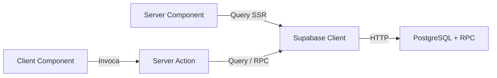
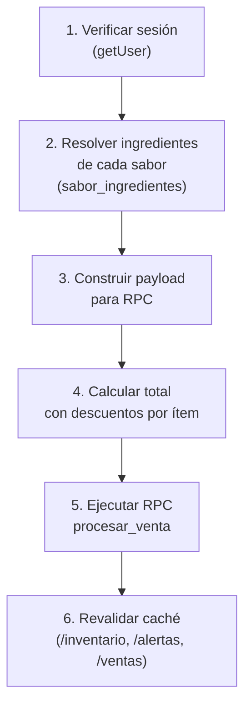

# 🔌 API y Funciones — Server Actions, RPCs y Llamadas Críticas

## Tabla de Contenidos

- [Arquitectura de API](#arquitectura-de-api)
- [Server Actions — Autenticación](#server-actions--autenticación)
- [Server Actions — Punto de Venta](#server-actions--punto-de-venta)
- [Server Actions — Ventas (Historial)](#server-actions--ventas-historial)
- [Server Actions — Inventario](#server-actions--inventario)
- [Server Actions — Ajustes de Stock](#server-actions--ajustes-de-stock)
- [Server Actions — Recetas de Sabores](#server-actions--recetas-de-sabores)
- [Server Actions — Raciones (Gramajes)](#server-actions--raciones-gramajes)
- [Funciones RPC de PostgreSQL](#funciones-rpc-de-postgresql)
- [Queries Críticas en Server Components](#queries-críticas-en-server-components)
- [Seguridad, Deuda Técnica y Recomendaciones](#seguridad-deuda-técnica-y-recomendaciones)

---

## Arquitectura de API

Las Pipzhas POS **no expone endpoints REST propios**. Todas las operaciones de datos se manejan a través de:

1. **Server Actions** (`'use server'`): Funciones invocadas directamente desde Client Components vía RPC de Next.js.
2. **Queries SSR**: React Server Components que ejecutan queries directas contra Supabase durante el renderizado.
3. **RPCs PL/pgSQL**: Funciones de PostgreSQL invocadas desde Server Actions para operaciones atómicas.



---

## Server Actions — Autenticación

### `loginUser(formData: FormData)`

> **Archivo:** `src/server/actions/auth.ts`

**Propósito:** Autenticar un usuario con email y contraseña contra Supabase Auth.

**Parámetros:**

| Parámetro | Tipo | Descripción |
|---|---|---|
| `formData` | `FormData` | Contiene `email` y `password` |

**Retorno:**

| Caso | Retorno | Acción |
|---|---|---|
| Éxito | — | `redirect('/pos')` (abandona la función) |
| Credenciales faltantes | `{ error: 'El correo electrónico y la contraseña son obligatorios.' }` | — |
| Error de auth | `{ error: error.message }` | — |

**Ejemplo de uso en el frontend:**

```typescript
// src/app/(auth)/login/page.tsx
const handleSubmit = (e: React.FormEvent<HTMLFormElement>) => {
  e.preventDefault();
  const formData = new FormData(e.currentTarget);
  startTransition(async () => {
    const res = await loginUser(formData);
    if (res?.error) {
      setErrorStatus(
        res.error.includes('credentials')
          ? 'Credenciales incorrectas. Revisa el correo y contraseña.'
          : res.error
      );
    }
  });
};
```

> **Nota:** No existe una acción de `logout`. El cierre de sesión no está implementado en la UI actual.

---

## Server Actions — Punto de Venta

### `processSale(cart: CartItem[], origenVenta: string)`

> **Archivo:** `src/server/actions/orders.ts`

**Propósito:** Orquesta el procesamiento completo de una venta desde el carrito hasta la deducción atómica de inventario.

**Flujo interno:**



**Parámetros:**

| Parámetro | Tipo | Default | Descripción |
|---|---|---|---|
| `cart` | `CartItem[]` | — | Items del carrito Zustand |
| `origenVenta` | `string` | `'Propio'` | Canal de venta |

**Payload enviado al RPC (por cada item del carrito):**

```typescript
{
  tamano_id:       string,       // UUID del tamaño
  tamano_nombre:   string,       // Nombre del tamaño (desnormalizado)
  sabor_1_nombre:  string|null,  // Nombre del sabor 1
  sabor_2_nombre:  string|null,  // Nombre del sabor 2 (null si completa)
  precio_unitario: number,       // Precio unitario sin descuento
  descuento_porcentaje: number,  // 0-100
  cantidad:        number,       // ≥ 1
  mitad_1:         [{ingrediente_id}], // Ingredientes resueltos del sabor 1
  mitad_2:         [{ingrediente_id}], // Ingredientes resueltos del sabor 2
  extras:          [{ingrediente_id}], // Toppings extra seleccionados
}
```

**Retorno:**

| Caso | Retorno |
|---|---|
| Éxito | `{ success: true }` |
| Sin sesión | `{ success: false, error: 'No tienes sesión administrativa activa.' }` |
| Error RPC | `{ success: false, error: 'Error en la base de datos: ...' }` |
| RPC abortó | `{ success: false, error: 'La base de datos abortó la transacción.' }` |
| Excepción | `{ success: false, error: err.message }` |

---

## Server Actions — Ventas (Historial)

### `getVentas()`

> **Archivo:** `src/server/actions/ventas.ts`

**Propósito:** Obtener todas las ventas ordenadas por fecha descendente.

```typescript
const { data } = await supabase
  .from('ventas')
  .select('*')
  .order('created_at', { ascending: false });
```

**Retorno:** `Venta[]` o `[]` si hay error.

> **⚠️ Sin paginación:** Carga TODAS las ventas de la base de datos en una sola query. Esto será problemático cuando el historial crezca.

---

### `deleteVenta(ventaId: string)`

> **Archivo:** `src/server/actions/ventas.ts`

**Propósito:** Cancelar/revertir una venta existente. Restaura el inventario y elimina el registro.

**Flujo:**
1. Verificar sesión
2. Llamar RPC `revertir_venta(p_venta_id, p_user_id)`
3. Revalidar `/ventas`, `/inventario`, `/alertas`

**Retorno:** `{ success: boolean, error?: string }`

---

### `editarOrigenVenta(ventaId: string, nuevoOrigen: string)`

> **Archivo:** `src/server/actions/ventas.ts`

**Propósito:** Modificar el canal de venta de una venta existente (ej: cambiar de "Propio" a "Rappi").

**Validación:** Solo acepta `['Propio', 'Rappi', 'DiDi']`.

```typescript
const { error } = await supabase
  .from('ventas')
  .update({ origen_venta: nuevoOrigen })
  .eq('id', ventaId);
```

**Retorno:** `{ success: boolean, error?: string }`

---

### `agregarItemsAVenta(ventaId: string, itemsNuevos: ItemNuevo[])`

> **Archivo:** `src/server/actions/ventas.ts`

**Propósito:** Agregar pizzas adicionales a una venta ya procesada. Descuenta inventario y actualiza los totales.

**Parámetros de cada item:**

```typescript
{
  tamano_id: string,
  tamano_nombre: string,
  sabor_1_id: string | null,
  sabor_1_nombre: string | null,
  sabor_2_id: string | null,
  sabor_2_nombre: string | null,
  precio_unitario: number,
  cantidad: number,
  es_mitades: boolean,
}
```

**Flujo interno:**
1. Verificar sesión
2. Obtener venta existente (`SELECT * FROM ventas WHERE id = ventaId`)
3. Resolver ingredientes de cada sabor nuevo desde `sabor_ingredientes`
4. Calcular deducciones de inventario con factor de mitad (0.5 si es mitad-y-mitad)
5. Descontar inventario via RPC `descontar_ingrediente` (por cada deducción)
6. Fusionar `cart_payload`, `deducciones` y `total_precio` con la venta existente
7. `UPDATE ventas` con los datos fusionados

> **⚠️ No es atómico:** A diferencia de `processSale`, este flujo hace múltiples queries secuenciales sin transacción. Si falla a mitad del proceso, el inventario podría quedar descontado sin que la venta se actualice.

---

## Server Actions — Inventario

### `adjustInventoryStock(ingredienteId, cantidadCambio, tipoMovimiento)`

> **Archivo:** `src/server/actions/inventory.ts`

**Propósito:** Ajustar el stock de un ingrediente (ingreso o merma) y registrar el movimiento.

| Parámetro | Tipo | Descripción |
|---|---|---|
| `ingredienteId` | `string` | UUID del ingrediente |
| `cantidadCambio` | `number` | Delta (positivo para ingreso, negativo para merma) |
| `tipoMovimiento` | `'merma' \| 'ajuste'` | Tipo para trazabilidad |

**Flujo:** Read stock actual → Calcula nuevo → Update ingredientes → Insert historial

> **⚠️ Race condition:** Patrón Read-then-Write sin locking. Dos operaciones simultáneas podrían generar valores incorrectos.

---

### `createIngredient(data)`

> **Archivo:** `src/server/actions/inventory.ts`

**Propósito:** Alta de un nuevo insumo en bodega.

```typescript
data: {
  nombre: string,
  stock_actual: number,
  unidad_medida: string,
  punto_reorden: number
}
```

---

### `verificarDependenciasIngrediente(ingredienteId)`

> **Archivo:** `src/server/actions/inventory.ts`

**Propósito:** Verificar cuántos sabores dependen de un ingrediente antes de eliminarlo. Retorna la lista de nombres de sabores vinculados para mostrar en el modal de confirmación.

**Retorno:**
```typescript
{
  cantidadDependencias: number,
  saboresVinculados: string[]
}
```

---

### `desactivarIngrediente(ingredienteId)`

> **Archivo:** `src/server/actions/inventory.ts`

**Propósito:** Soft Delete de un ingrediente:
1. Desvincular de `sabor_ingredientes`
2. Desvincular de `recetas_toppings`
3. Marcar `activo = false`

El historial de inventario se preserva intacto para auditoría.

---

### `actualizarUmbralesBatch(cambios)`

> **Archivo:** `src/server/actions/inventory.ts`

**Propósito:** Actualizar el `punto_reorden` de múltiples ingredientes en batch.

```typescript
cambios: Array<{ id: string, punto_reorden: number }>
```

**Implementación:** Loop secuencial de UPDATEs individuales. Si alguno falla, acumula el error pero continúa.

---

## Server Actions — Ajustes de Stock

### `adjustStock(ingredienteId, cantidadCambio, tipoMovimiento, userId, notas)`

> **Archivo:** `src/server/actions/adjustments.ts`

**Propósito:** Módulo alternativo de ajustes con soporte para notas y tipo `'compra'`.

| Parámetro | Tipo | Default | Descripción |
|---|---|---|---|
| `ingredienteId` | `string` | — | UUID del ingrediente |
| `cantidadCambio` | `number` | — | Delta con signo |
| `tipoMovimiento` | `'merma' \| 'ajuste' \| 'compra'` | — | Tipo de movimiento |
| `userId` | `string` | — | UUID del usuario que ejecuta |
| `notas` | `string` | `''` | Contexto del movimiento |

**Diferencias con `adjustInventoryStock`:**
- Soporta tipo `'compra'`
- Acepta `notas`
- Escribe en campos diferentes de `historial_inventario` (`cantidad` y `usuario_id` en lugar de `cantidad_cambio` y `created_by`)
- Instancia su propio Supabase client en lugar de usar `createClient()`

> **⚠️ Módulo duplicado:** Consolidar con `adjustInventoryStock` para evitar divergencia.

---

## Server Actions — Recetas de Sabores

### `getSaboresConIngredientes()`

> **Archivo:** `src/server/actions/recipes.ts`

**Propósito:** Obtener sabores, relaciones pivot e ingredientes activos en una sola llamada.

```typescript
const [saboresResponse, relacionesResponse, ingredientesResponse] = await Promise.all([
  supabase.from('sabores').select('*').order('nombre'),
  supabase.from('sabor_ingredientes').select('sabor_id, ingrediente_id'),
  supabase.from('ingredientes').select('id, nombre, unidad_medida').eq('activo', true).order('nombre'),
]);
```

**Retorno:** `{ sabores, relaciones, ingredientes }`

---

### `crearSabor(nombre, descripcion)`

> Crea un nuevo sabor. Maneja constraint UNIQUE (error `23505`).

### `eliminarSabor(saborId)`

> Elimina un sabor. Las relaciones en `sabor_ingredientes` se eliminan por CASCADE.

### `agregarIngredienteASabor(saborId, ingredienteId)`

> Crea relación pivot. Maneja duplicados (error `23505`).

### `removerIngredienteDeSabor(saborId, ingredienteId)`

> Elimina relación pivot. No afecta al ingrediente ni a la bodega.

---

## Server Actions — Raciones (Gramajes)

### `getRacionesData()`

> **Archivo:** `src/server/actions/raciones.ts`

**Propósito:** Obtener datos para la grilla de raciones (tamaños × ingredientes × porciones).

```typescript
const [tamanos, ingredientes, recetas] = await Promise.all([
  supabase.from('tamanos_pizza').select('*').order('masa_gr', { ascending: true }),
  supabase.from('ingredientes').select('id, nombre, unidad_medida').order('nombre'),
  supabase.from('recetas_toppings').select('*')
]);
```

> **Nota:** Esta query trae TODOS los ingredientes (incluyendo inactivos), a diferencia de la página de inventario que filtra por `activo = true`.

---

### `updateRecetaTopping(ingredienteId, tamanoId, porcionGr)`

> Actualiza una celda individual de la grilla. Si `porcionGr <= 0`, elimina la receta.

**Patrón:** Delete-then-Insert (no es un upsert nativo).

---

### `saveRacionesBatch(cambios)`

> Guarda cambios masivos de la grilla. Separa en upserts (porción > 0) y deletes (porción ≤ 0).

```typescript
cambios: Array<{ ingrediente_id: string, tamano_id: string, porcion_gr: number }>
```

---

### `updateTamanoBase(tamanoId, field, value)`

> Actualiza un campo base de un tamaño de pizza (`masa_gr`, `salsa_gr` o `queso_base_gr`).

---

### `removeIngredienteFromRecetas(ingredienteId)`

> Elimina un ingrediente de TODAS las recetas de toppings (no lo borra de bodega).

---

### `addIngredienteToRecetas(ingredienteId, tamanoIds)`

> Agrega un ingrediente a la grilla de recetas con porción 0 para todos los tamaños especificados.

---

## Funciones RPC de PostgreSQL

### `procesar_venta`

Ver documentación detallada en [database.md](./database.md#funciones-rpc-plpgsql).

**Invocación desde Server Action:**

```typescript
const { data, error } = await supabase.rpc('procesar_venta', {
  cart_payload:       payload,       // JSONB array de items
  p_total_precio:     totalFinal,    // Total con descuentos
  p_user_id:          user.id,       // UUID del cajero
  p_origen_venta:     origenVenta,   // 'Propio' | 'Rappi' | 'DiDi'
  p_descuento_global: 0,            // Siempre 0 actualmente
});
```

### `revertir_venta`

**Invocación:**

```typescript
const { data, error } = await supabase.rpc('revertir_venta', {
  p_venta_id: ventaId,
  p_user_id:  user.id,
});
```

### `descontar_ingrediente`

**Invocación (desde `agregarItemsAVenta`):**

```typescript
const { error } = await supabase.rpc('descontar_ingrediente', {
  p_ingrediente_id: deduccion.ing_id,
  p_cantidad:       deduccion.cantidad_descontar,
});
```

---

## Queries Críticas en Server Components

### POS Page — Carga de Menú

```typescript
// src/app/(dashboard)/pos/page.tsx
const { data: tamanos } = await supabase
  .from('tamanos_pizza')
  .select('*')
  .order('created_at', { ascending: true });

const { data: sabores } = await supabase
  .from('sabores')
  .select('*')
  .order('nombre', { ascending: true });

// Filtro de ingredientes base para la UI de extras
const { data: ingredientes } = await supabase
  .from('ingredientes')
  .select('id, nombre')
  .neq('nombre', 'Masa')
  .neq('nombre', 'Salsa')
  .neq('nombre', 'Queso')
  .neq('nombre', 'Cajas Mediana')
  .neq('nombre', 'Servilletas');
```

> **⚠️ Filtro frágil:** Los ingredientes se filtran por nombre para excluir insumos base de la UI de extras. Si los nombres cambian o se agregan nuevos empaques, aparecerán como extras seleccionables.

### Alertas — Insumos Críticos

```typescript
// src/app/(dashboard)/alertas/page.tsx
const { data: ingredientes } = await supabase
  .from('ingredientes')
  .select('id, nombre, stock_actual, punto_reorden, unidad_medida')
  .order('stock_actual', { ascending: true });

// Filtro en el servidor (no en la query)
const insumosCriticos = ingredientes?.filter(
  ing => ing.stock_actual <= ing.punto_reorden
) || [];
```

> **Optimización posible:** Mover el filtro a la query SQL: `.lte('stock_actual', supabase.raw('punto_reorden'))` o usar un RPC.

### Ventas Page — Carga con Diccionarios de Apoyo

```typescript
// src/app/(dashboard)/ventas/page.tsx
const ventas = await getVentas();
const { data: datosIngredientes } = await supabase
  .from('ingredientes')
  .select('id, nombre, unidad_medida');
const { data: tamanos } = await supabase
  .from('tamanos_pizza')
  .select('id, nombre, precio')
  .order('created_at', { ascending: true });
const { data: sabores } = await supabase
  .from('sabores')
  .select('id, nombre')
  .order('nombre', { ascending: true });
```

> Los diccionarios se usan para mapear UUIDs a nombres legibles en el desglose de cada venta.

---

## Seguridad, Deuda Técnica y Recomendaciones

### 🔴 Críticos

#### 1. `agregarItemsAVenta` No Es Atómico

A diferencia de `processSale` (que delega al RPC transaccional), `agregarItemsAVenta` ejecuta múltiples queries secuenciales:
- N llamadas a `descontar_ingrediente` (una por deducción)
- 1 UPDATE a ventas

Si el UPDATE final falla, el inventario queda descontado sin reflejo en la venta.

**Recomendación:** Crear un RPC `agregar_items_venta` que encapsule toda la operación en una transacción.

#### 2. Sin Validación de Permisos por Rol

Todas las acciones solo verifican `getUser()` (si existe sesión), pero no validan roles. Cualquier usuario autenticado puede:
- Cancelar ventas de otros usuarios
- Modificar inventario
- Editar gramajes y recetas

#### 3. Filtro de Extras por Nombre Hardcodeado

```typescript
.neq('nombre', 'Masa')
.neq('nombre', 'Salsa')
// ...
```

Esto usa nombres hardcodeados que **no coinciden con los nombres reales** del seed v2 (ej: `'Masa'` vs `'Masa (Bollo crudo)'`). Podría estar mostrando ingredientes base como extras.

### 🟠 Deuda Técnica

| # | Problema | Recomendación |
|---|---|---|
| 4 | `getVentas()` sin paginación | Implementar cursor-based pagination |
| 5 | Múltiples patrones de instanciación del cliente Supabase | Estandarizar en `createClient()` de `server.ts` |
| 6 | `actualizarUmbralesBatch` hace N queries en loop | Migrar a un `UPDATE ... CASE WHEN` o RPC |
| 7 | Error handling inconsistente entre acciones | Estandarizar en tipo `ActionResponse` |
