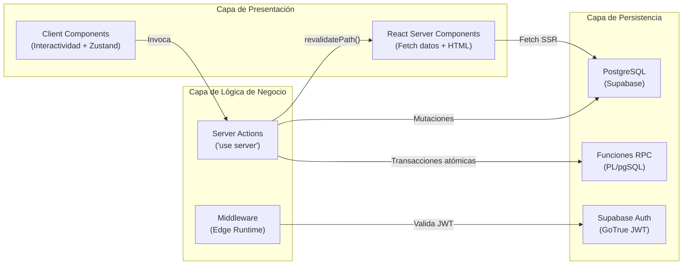
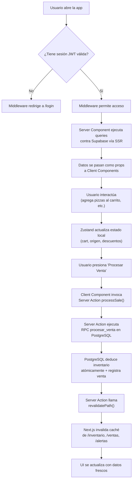
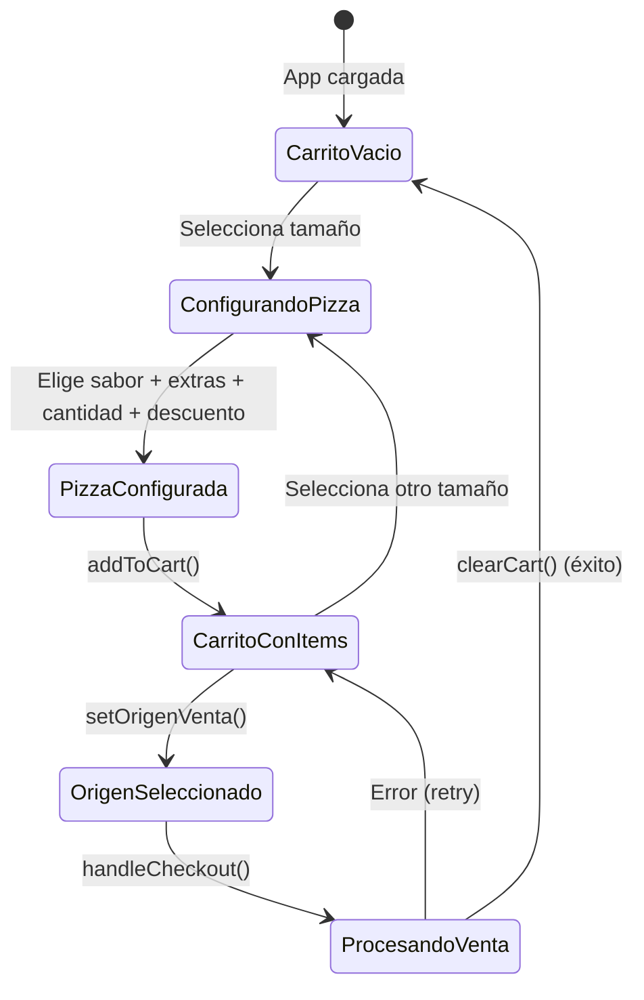
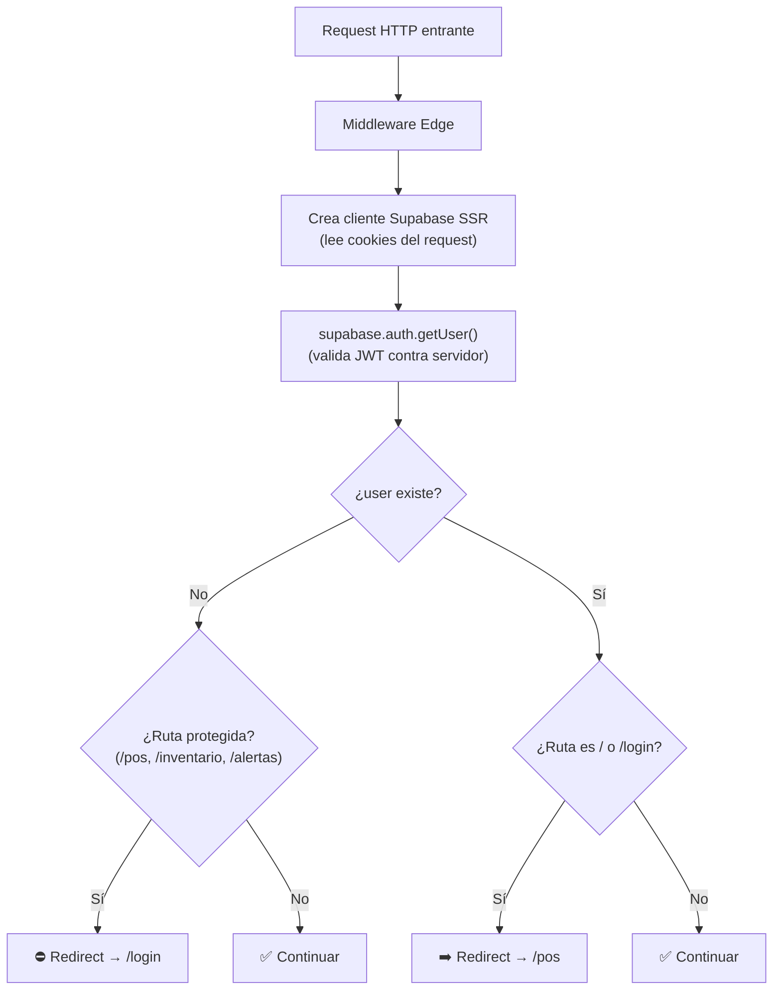
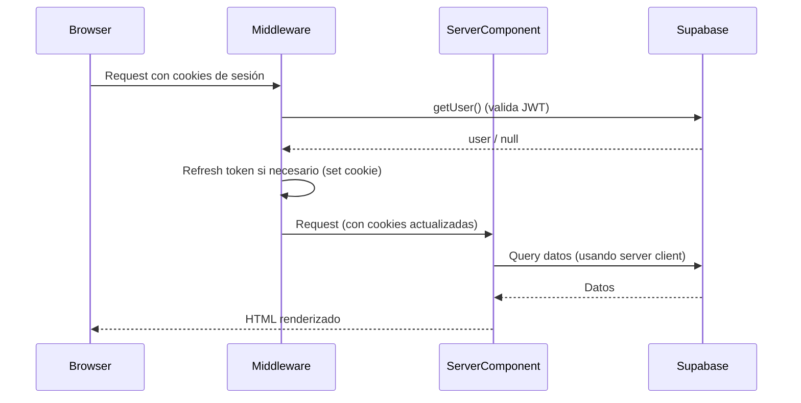
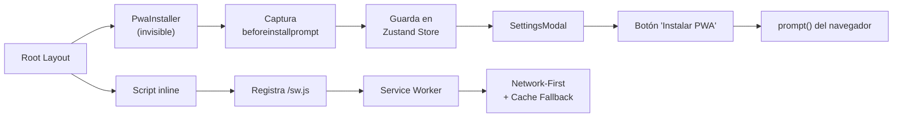
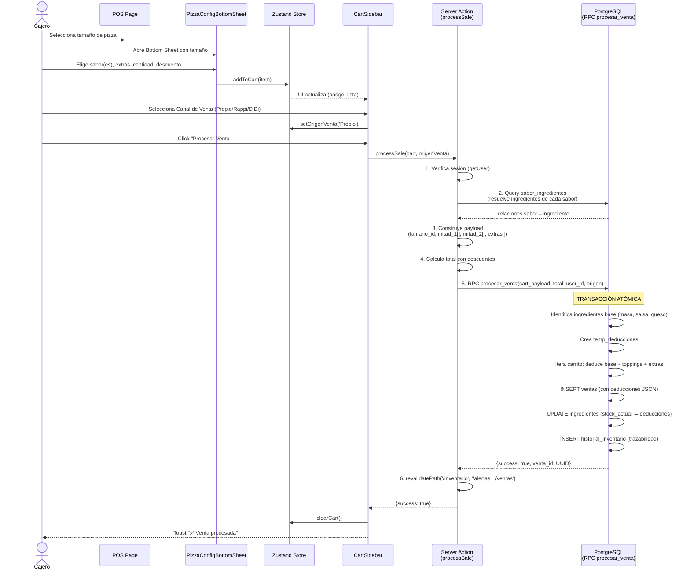
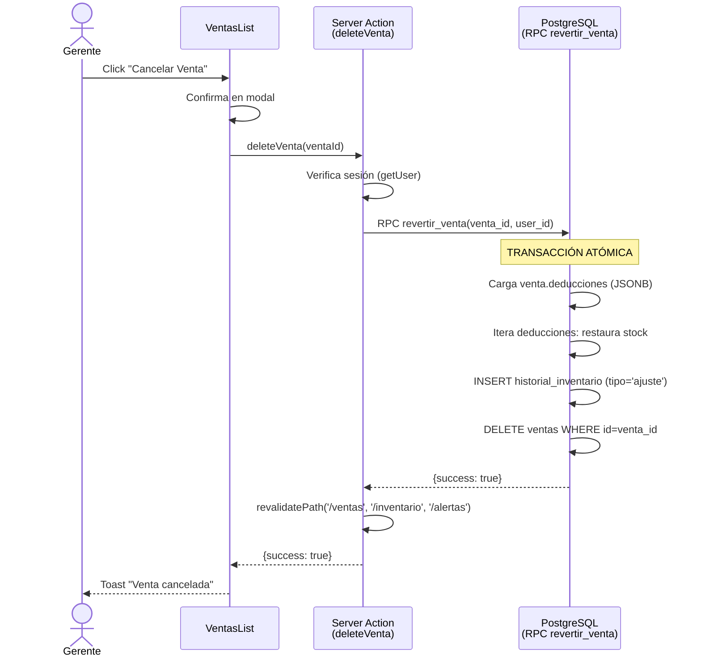
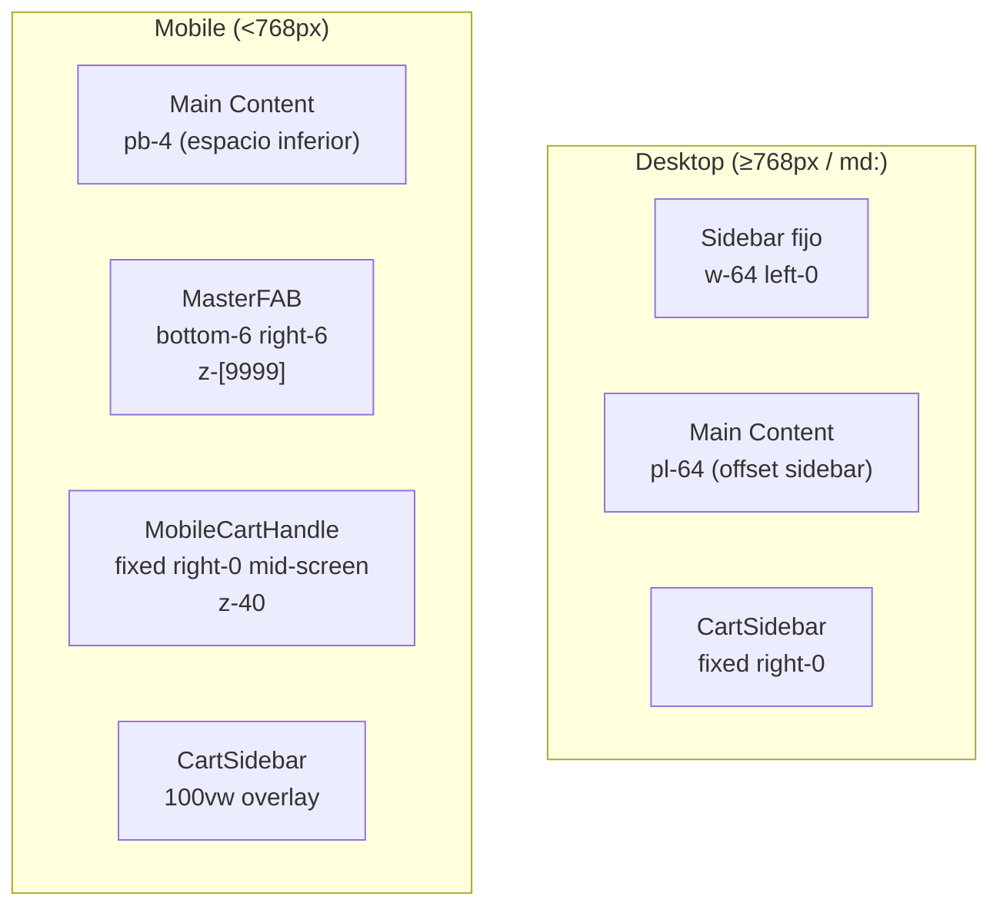

# 🏛️ Arquitectura del Sistema — Las Pipzhas POS

## Tabla de Contenidos

- [Modelo Arquitectónico](#modelo-arquitectónico)
- [Flujo de Datos General](#flujo-de-datos-general)
- [Manejo de Estado en el Cliente](#manejo-de-estado-en-el-cliente)
- [Patrón Server Components + Server Actions](#patrón-server-components--server-actions)
- [Middleware de Autenticación](#middleware-de-autenticación)
- [Integración con Supabase](#integración-con-supabase)
- [PWA y Service Worker](#pwa-y-service-worker)
- [Diagrama de Secuencia: Flujo de Venta](#diagrama-de-secuencia-flujo-de-venta)
- [Diagrama de Secuencia: Reversión de Venta](#diagrama-de-secuencia-reversión-de-venta)
- [Diseño Responsivo y App Shell](#diseño-responsivo-y-app-shell)
- [Seguridad, Deuda Técnica y Recomendaciones](#seguridad-deuda-técnica-y-recomendaciones)

---

## Modelo Arquitectónico

La aplicación sigue una arquitectura de **tres capas** con separación clara entre presentación, lógica de negocio y persistencia:



### Decisiones Arquitectónicas Clave

1. **Sin API REST propia**: Las mutaciones se manejan exclusivamente a través de Server Actions de Next.js (`'use server'`), eliminando la necesidad de un backend separado o endpoints API.

2. **RPC para operaciones críticas**: La venta (que debe deducir inventario de múltiples ingredientes) se delega a una función PL/pgSQL con `SECURITY DEFINER` para garantizar atomicidad transaccional completa.

3. **Estado mínimo en el cliente**: Solo el carrito de compras (`usePosStore`) vive en Zustand. Todos los datos maestros (ingredientes, sabores, tamaños, ventas) se obtienen en el servidor como RSC y se pasan como `props`.

4. **Cookies-based auth**: La sesión se gestiona vía cookies HTTP (no localStorage), lo que permite que tanto el middleware Edge como los Server Components accedan al estado de autenticación.

---

## Flujo de Datos General



---

## Manejo de Estado en el Cliente

### Zustand Store: `usePosStore`

El único store global de la aplicación (`src/store/usePosStore.ts`) gestiona exclusivamente el estado del flujo de venta:



#### Estructura del Estado

| Propiedad | Tipo | Propósito |
|---|---|---|
| `cart` | `CartItem[]` | Array de pizzas configuradas en la orden actual |
| `isCartOpen` | `boolean` | Visibilidad del sidebar del carrito |
| `origenVenta` | `'Propio' \| 'Rappi' \| 'DiDi' \| null` | Canal de venta (requerido para checkout) |
| `pwaInstallPrompt` | `BeforeInstallPromptEvent \| null` | Evento capturado para instalación PWA |

#### Selectores Derivados (Calculados)

| Selector | Lógica |
|---|---|
| `getSubtotal()` | `Σ (precio_unitario × cantidad)` por cada item |
| `getDescuentoAmount()` | `Σ (precio_unitario × cantidad × descuento_porcentaje/100)` por item |
| `getTotal()` | `getSubtotal() - getDescuentoAmount()` |
| `getCartItemCount()` | `Σ cantidad` por cada item |

#### Modelo `CartItem`

```typescript
type CartItem = {
  id: string;               // crypto.randomUUID()
  tamano_id: string;         // FK a tamanos_pizza
  tamano_nombre: string;     // Desnormalizado para display
  precio_unitario: number;   // Calculado por PizzaConfigBottomSheet
  descuento_porcentaje?: number; // 0-100, por ítem
  es_mitades: boolean;       // Completa (false) o Mitad y Mitad (true)
  sabor_1?: Sabor;           // Sabor completo o mitad 1
  sabor_2?: Sabor;           // Solo si es_mitades = true
  extras: Topping[];         // Ingredientes extra (porción completa)
  cantidad: number;          // ≥ 1
};
```

### ¿Por qué Zustand y no Context API?

La decisión de usar Zustand responde a un requerimiento real del dominio: el carrito de compras necesita:

1. **Persistencia entre navegaciones** dentro del dashboard (sin perderse al cambiar de ruta).
2. **Acceso transversal**: El `CartSidebar`, `MobileCartHandle`, `MasterFAB` y `CartToggle` necesitan acceder al mismo estado desde diferentes puntos del árbol de componentes.
3. **Selectores derivados** sin re-renders innecesarios (subtotal, descuento, total).
4. **Integración con PWA** (evento `beforeinstallprompt`).

---

## Patrón Server Components + Server Actions

### Patrón General de Cada Página

Todas las páginas del dashboard siguen un patrón consistente:

```
Server Component (page.tsx)
  ├── Fetch datos desde Supabase vía SSR
  ├── Manejo de errores inline
  └── Renderiza Client Component con datos como props
        └── Client Component ('use client')
              ├── useState/useTransition para UI local
              ├── Invoca Server Actions para mutaciones
              └── toast() para feedback
```

**Ejemplo concreto — Página de Inventario:**

```typescript
// src/app/(dashboard)/inventario/page.tsx — Server Component
export default async function InventarioPage() {
  const supabase = await createClient(); // Server-side
  const { data: ingredientes } = await supabase
    .from('ingredientes')
    .select('id, nombre, stock_actual, unidad_medida, punto_reorden')
    .eq('activo', true)
    .order('nombre', { ascending: true });

  return <InventoryManager ingredientes={ingredientes || []} />;
}
```

```typescript
// src/components/inventory/InventoryManager.tsx — Client Component
'use client';
export function InventoryManager({ ingredientes }) {
  const [isPending, startTransition] = useTransition();

  const handleAdjust = () => {
    startTransition(async () => {
      const res = await adjustInventoryStock(id, delta, tipo);
      if (res.error) toast.error(res.error);
      else toast.success('Stock actualizado.');
      // revalidatePath() en el Server Action refresca esta página
    });
  };
}
```

### Mapa de Server Actions

| Archivo | Acción | Propósito |
|---|---|---|
| `auth.ts` | `loginUser` | Autenticación con email/password |
| `orders.ts` | `processSale` | Venta completa (resuelve ingredientes → calcula totales → RPC atómico) |
| `ventas.ts` | `getVentas` | Listado de ventas (solo lectura) |
| `ventas.ts` | `deleteVenta` | Reversión de venta vía RPC `revertir_venta` |
| `ventas.ts` | `editarOrigenVenta` | Modificar canal de venta post-venta |
| `ventas.ts` | `agregarItemsAVenta` | Agregar pizzas a una venta existente |
| `inventory.ts` | `adjustInventoryStock` | Ingreso/merma de stock + historial |
| `inventory.ts` | `createIngredient` | Alta de nuevo insumo |
| `inventory.ts` | `verificarDependenciasIngrediente` | Check de recetas vinculadas pre-borrado |
| `inventory.ts` | `desactivarIngrediente` | Soft delete (activo=false) + desvinculación |
| `inventory.ts` | `actualizarUmbralesBatch` | Update masivo de puntos de reorden |
| `adjustments.ts` | `adjustStock` | Módulo alternativo de ajustes (merma/ajuste/compra) |
| `recipes.ts` | `getSaboresConIngredientes` | Fetch de sabores + relaciones + ingredientes |
| `recipes.ts` | `crearSabor` | Crear sabor de pizza |
| `recipes.ts` | `eliminarSabor` | Eliminar sabor (CASCADE en pivot) |
| `recipes.ts` | `agregarIngredienteASabor` | Vincular ingrediente a sabor |
| `recipes.ts` | `removerIngredienteDeSabor` | Desvincular ingrediente de sabor |
| `raciones.ts` | `getRacionesData` | Fetch de tamaños + ingredientes + recetas |
| `raciones.ts` | `updateRecetaTopping` | Actualizar porción individual |
| `raciones.ts` | `saveRacionesBatch` | Guardar cambios masivos en grilla |
| `raciones.ts` | `updateTamanoBase` | Actualizar masa/salsa/queso base por tamaño |
| `raciones.ts` | `removeIngredienteFromRecetas` | Eliminar ingrediente de recetas |
| `raciones.ts` | `addIngredienteToRecetas` | Agregar ingrediente a todas las recetas |

---

## Middleware de Autenticación

El middleware (`src/middleware.ts`) opera en **Edge Runtime** y es la primera línea de defensa:



### Rutas Protegidas

```
/pos         → Requiere sesión
/inventario  → Requiere sesión
/alertas     → Requiere sesión
```

> **⚠️ Observación importante:** Las rutas `/ventas`, `/sabores`, `/raciones` y `/reportes` **NO están incluidas** en la configuración de rutas protegidas del middleware. Esto significa que un usuario no autenticado podría acceder a esas rutas si navega directamente. Sin embargo, las Server Actions validan la sesión individualmente, lo que protege las mutaciones pero no la lectura de datos.

### Matcher Configuration

El middleware se aplica a **todas las rutas** excepto archivos estáticos:

```typescript
export const config = {
  matcher: [
    '/((?!_next/static|_next/image|favicon.ico|.*\\.(?:svg|png|jpg|jpeg|gif|webp)$).*)',
  ],
};
```

---

## Integración con Supabase

### Dos Clientes, Un Propósito

| Cliente | Archivo | Uso |
|---|---|---|
| **Browser Client** | `src/lib/supabase/client.ts` | Client Components que necesitan auth interactiva |
| **Server Client** | `src/lib/supabase/server.ts` | Server Components, Server Actions y middleware |

### Flujo de Cookies



### ¿Por qué ANON_KEY es pública?

La `NEXT_PUBLIC_SUPABASE_ANON_KEY` es una clave de acceso público con permisos limitados por **Row Level Security (RLS)**. Supabase fue diseñado para que esta clave sea segura en el frontend, ya que:

1. Las políticas RLS restringen qué filas puede leer/escribir cada usuario.
2. Las funciones RPC con `SECURITY DEFINER` ejecutan con los permisos del creador de la función, no del usuario que las llama.
3. La autenticación real se gestiona por JWT (no por la ANON_KEY).

---

## PWA y Service Worker

### Componentes PWA



### Estrategia del Service Worker (`public/sw.js`)

- **Install**: Pre-cachea el App Shell (`/`, `/pos`, `/offline.html`, `/manifest.json`).
- **Activate**: Limpia cachés obsoletas y toma control inmediato (`skipWaiting` + `clients.claim`).
- **Fetch**: **Network-First** — intenta red primero, cachea la respuesta exitosa. Si falla, sirve desde caché. Para navegaciones sin caché, muestra `/offline.html`.
- **Exclusiones**: No intercepta requests a `supabase.co` (datos siempre frescos) ni hot-reload de Next.js en dev.

---

## Diagrama de Secuencia: Flujo de Venta



---

## Diagrama de Secuencia: Reversión de Venta



---

## Diseño Responsivo y App Shell

### Layout del Dashboard



### Jerarquía de Z-Index

| Componente | Z-Index | Razón |
|---|---|---|
| NavigationShell (Sidebar) | `z-50` | Por encima del contenido, debajo de modales |
| CartSidebar | `z-[60]` | Por encima del sidebar |
| PizzaConfigBottomSheet | `z-[70]` | Por encima del carrito |
| MobileCartHandle | `z-[40]` | Debajo de todo para no interferir |
| MasterFAB (Portal) | `z-[9999]` | Absolutamente por encima de todo |
| SettingsModal | `z-[200]` | Modal de configuración |
| Backdrop (genérico) | `z-[9998]` | Detrás del FAB, delante del contenido |

### Navegación Mobile

- **MasterFAB**: Botón flotante renderizado vía `createPortal(document.body)` para evitar `overflow:hidden`. Al presionarlo despliega un menú radial con las 7 rutas de navegación + configuración. Incluye badge con cantidad de items en el carrito.

- **MobileCartHandle**: Indicador visual fijo en el borde derecho (solo en `/pos`). Soporta gestos de swipe:
  - Swipe ←  desde borde derecho → abre carrito
  - Swipe →  con carrito abierto → cierra carrito
  - Umbral mínimo: 60px de desplazamiento horizontal

---

## Seguridad, Deuda Técnica y Recomendaciones

### 🔴 Alertas Críticas de Seguridad

#### 1. Rutas del Dashboard Sin Protección en Middleware

Las rutas `/ventas`, `/sabores`, `/raciones` y `/reportes` no están incluidas en la configuración `isProtectedRoute` del middleware. Si bien los Server Actions validan la sesión para mutaciones, los **React Server Components pueden exponer datos de lectura** a usuarios no autenticados.

**Recomendación:** Expandir `isProtectedRoute` para cubrir todas las rutas del grupo `(dashboard)`:

```typescript
const isProtectedRoute =
  nextPath.startsWith('/pos') ||
  nextPath.startsWith('/inventario') ||
  nextPath.startsWith('/alertas') ||
  nextPath.startsWith('/ventas') ||    // ← Agregar
  nextPath.startsWith('/sabores') ||   // ← Agregar
  nextPath.startsWith('/raciones') ||  // ← Agregar
  nextPath.startsWith('/reportes');    // ← Agregar
```

#### 2. Token OIDC de Vercel Expuesto en `.env.local`

El archivo `.env.local` contiene un `VERCEL_OIDC_TOKEN` que es un JWT firmado con datos del proyecto Vercel. Aunque probablemente sea de corta duración, **no debería estar versionado** ni compartido. Verificar que `.env.local` está en `.gitignore`.

#### 3. SECURITY DEFINER en RPCs Sin Validación de Roles

Las funciones `procesar_venta` y `revertir_venta` usan `SECURITY DEFINER`, lo que significa que **ejecutan con los permisos del creador de la función** (superusuario de Supabase). No hay validación interna de que el `p_user_id` corresponda a un rol autorizado para ventas.

**Recomendación:** Agregar un `IF NOT EXISTS (SELECT 1 FROM auth.users WHERE id = p_user_id)` al inicio de cada RPC, o implementar un sistema de roles en una tabla personalizada.

### 🟠 Deuda Técnica

#### 4. Race Condition en Ajustes de Inventario

`adjustInventoryStock` y `adjustStock` hacen **Read → Update** secuencial sin transacción atómica ni locking optimista. Si dos usuarios ajustan el mismo ingrediente simultáneamente, el segundo sobrescribirá el valor del primero.

**Recomendación:** Migrar a un RPC con `UPDATE ... SET stock_actual = stock_actual + $delta` directo (sin read previo), o usar `SELECT ... FOR UPDATE`.

#### 5. Módulo Duplicado de Ajustes

Existen dos archivos que manejan ajustes de inventario:
- `inventory.ts` → `adjustInventoryStock()`
- `adjustments.ts` → `adjustStock()`

Ambos hacen lo mismo con implementaciones ligeramente diferentes (uno usa `createClient()`, el otro instancia el cliente manualmente). Esto genera confusión y riesgo de divergencia.

**Recomendación:** Consolidar en un solo módulo. Eliminar `adjustments.ts` y usar `inventory.ts` como canónico.

#### 6. Precios Hardcodeados en el Frontend

La lógica de precios de pizza está hardcodeada en `PizzaConfigBottomSheet.tsx` con un `switch-case` basado en el nombre del sabor:

```typescript
if (s.includes('trifásica')) return isPersonal ? 32000 : 42000;
if (s.includes('polloroni')) return isPersonal ? 29000 : 42000;
// ...
```

Esto hace que **cualquier cambio de precios requiera un re-deploy**. No hay tabla de precios en la base de datos.

**Recomendación:** Crear una tabla `precios_sabor` con columnas `(sabor_id, tamano_id, precio)` y mover la lógica de precios al servidor.

#### 7. Tamaño "Grande" Sin Soporte de Precios

La lógica de precios solo distingue entre `personal` y `todo lo demás`. Si existe un tamaño "Grande (45cm)" (como indica seed_v2), no tiene diferenciación de precio respecto a "Mediana". Toda pizza no-personal cuesta lo mismo.

#### 8. TypeScript `strict: false`

La configuración de TypeScript tiene `strict: false`, lo que desactiva null-checks estrictos, strict function types, y otras protecciones. Hay uso extensivo de `any` (ej: `tamano: any` en `PizzaConfigBottomSheet`).

**Recomendación:** Habilitar `strict: true` gradualmente y reemplazar los `any` por tipos específicos.

#### 9. InventoryManager Excede 580 Líneas

El componente `InventoryManager.tsx` (588 líneas) viola el principio de componentes ≤ 150 líneas. Contiene la tabla de inventario, 3 modales (nuevo insumo, ajuste de stock, confirmación de borrado) y lógica de modo edición inline.

**Recomendación:** Extraer `NuevoInsumoModal`, `AjusteStockModal` y `ConfirmDeleteModal` como componentes independientes.

#### 10. Upsert Emulado con Delete-then-Insert

En `raciones.ts`, los "upserts" se emulan borrando el registro existente y luego insertando uno nuevo. Esto no es atómico y puede dejar la tabla en un estado inconsistente si el insert falla después del delete.

**Recomendación:** Agregar una constraint `UNIQUE(ingrediente_id, tamano_id)` a `recetas_toppings` y usar el método nativo `.upsert()` de Supabase.

### 🟡 Mejoras Sugeridas

| # | Categoría | Mejora |
|---|---|---|
| 11 | **Auth** | Implementar logout (actualmente no existe botón/acción de cerrar sesión) |
| 12 | **Auth** | Sistema de roles (cajero vs gerente) para restringir cancelación de ventas |
| 13 | **UX** | Agregar confirmación antes de vaciar el carrito completo |
| 14 | **Performance** | Paginar la lista de ventas (actualmente carga TODAS las ventas) |
| 15 | **Observabilidad** | Agregar logging estructurado para trazabilidad de errores en producción |
| 16 | **Testing** | No existen tests unitarios ni de integración. Priorizar tests para `processSale` y los RPCs |
| 17 | **Tipos** | El archivo `pos.types.ts` define tipos que no se usan; el store define sus propios tipos |
