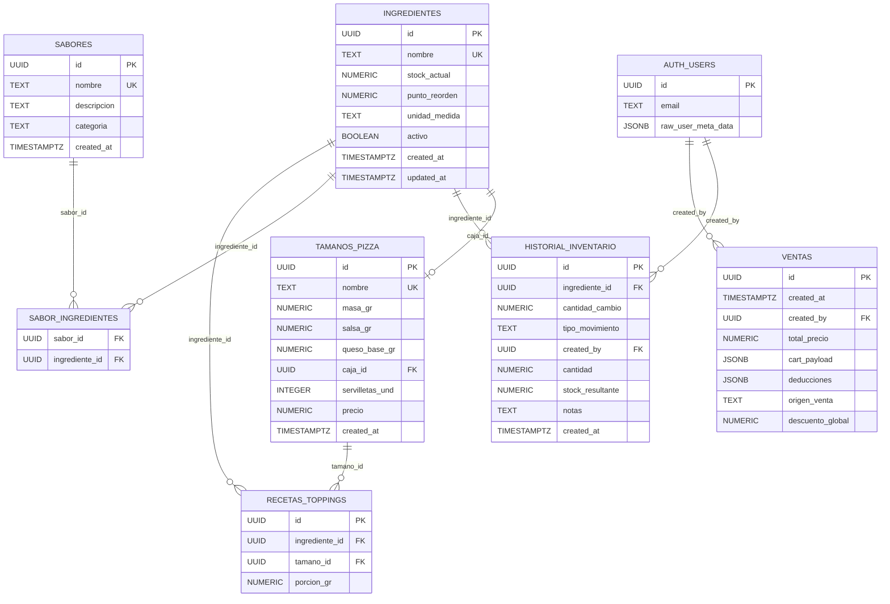

# 🗄️ Base de Datos — Diccionario de Datos y Políticas RLS

## Tabla de Contenidos

- [Diagrama Entidad-Relación (ERD)](#diagrama-entidad-relación-erd)
- [Tablas del Sistema](#tablas-del-sistema)
  - [ingredientes](#ingredientes)
  - [tamanos_pizza](#tamanos_pizza)
  - [recetas_toppings](#recetas_toppings)
  - [sabores](#sabores)
  - [sabor_ingredientes](#sabor_ingredientes)
  - [historial_inventario](#historial_inventario)
  - [ventas](#ventas)
- [Políticas de Row Level Security (RLS)](#políticas-de-row-level-security-rls)
- [Funciones RPC (PL/pgSQL)](#funciones-rpc-plpgsql)
- [Tablas de Supabase Auth](#tablas-de-supabase-auth)
- [Seeds de Datos](#seeds-de-datos)
- [Seguridad, Deuda Técnica y Recomendaciones](#seguridad-deuda-técnica-y-recomendaciones)

---

## Diagrama Entidad-Relación (ERD)



---

## Tablas del Sistema

### ingredientes

> **Propósito:** Maestro de insumos de la pizzería. Representa todo lo que se consume o se compra: ingredientes de pizza, empaques, servilletas, etc.

| Columna | Tipo | Nullable | Default | Descripción |
|---|---|---|---|---|
| `id` | `UUID` | ❌ | `gen_random_uuid()` | Identificador único del ingrediente |
| `nombre` | `TEXT` | ❌ | — | Nombre descriptivo del insumo. Se usa para lookups de ingredientes base en RPCs (ej: `'Masa (Bollo crudo)'`, `'Queso Mozzarella'`) |
| `stock_actual` | `NUMERIC` | ❌ | `0` | Cantidad disponible en bodega en la unidad de medida correspondiente. Se actualiza automáticamente por ventas (RPC) y manualmente por ajustes |
| `punto_reorden` | `NUMERIC` | ❌ | `0` | Umbral de alerta. Cuando `stock_actual <= punto_reorden`, el insumo aparece en el Dashboard de Alertas (`/alertas`) |
| `unidad_medida` | `TEXT` | ❌ | `'gr'` | Unidad de medida (`gr`, `und`, `ml`, etc.) |
| `activo` | `BOOLEAN` | ❌ | `true` | Flag de Soft Delete. Cuando es `false`, el ingrediente no aparece en la UI ni se incluye en queries. El historial se preserva |
| `created_at` | `TIMESTAMPTZ` | ❌ | `now()` | Fecha de creación del registro |
| `updated_at` | `TIMESTAMPTZ` | ✅ | `now()` | Última actualización de stock o datos. Actualizado por RPCs y triggers |

#### Constraints Notables
- `nombre` tiene constraint `UNIQUE` (implícito por uso en RPCs con `LIMIT 1`)
- No tiene FK externas, pero es referenciada por `recetas_toppings`, `sabor_ingredientes`, `historial_inventario` y `tamanos_pizza.caja_id`

#### Ingredientes Especiales (Hardcodeados en RPCs)
Los RPCs de venta buscan estos ingredientes **por nombre exacto**:

| Nombre exacto | Rol en el RPC |
|---|---|
| `'Masa (Bollo crudo)'` | Deducción de masa base por tamaño |
| `'Salsa de Tomate'` | Deducción de salsa base por tamaño |
| `'Queso Mozzarella'` | Deducción de queso base por tamaño |
| `'Servilletas'` | Deducción de servilletas por tamaño |

> **⚠️ Riesgo:** Si alguien renombra estos ingredientes, las ventas dejarán de deducir insumos base correctamente. Los RPCs fallarían silenciosamente (variable `v_id_X` quedaría `NULL`).

---

### tamanos_pizza

> **Propósito:** Define los tamaños de pizza disponibles y sus reglas de consumo de insumos base.

| Columna | Tipo | Nullable | Default | Descripción |
|---|---|---|---|---|
| `id` | `UUID` | ❌ | `gen_random_uuid()` | Identificador único |
| `nombre` | `TEXT` | ❌ | — | Nombre del tamaño (ej: `'Personal (25cm)'`, `'Mediana (35cm)'`, `'Grande (45cm)'`) |
| `masa_gr` | `NUMERIC` | ❌ | — | Gramos de masa base que consume este tamaño |
| `salsa_gr` | `NUMERIC` | ❌ | — | Gramos de salsa base que consume este tamaño |
| `queso_base_gr` | `NUMERIC` | ❌ | — | Gramos de queso base que consume este tamaño |
| `caja_id` | `UUID` | ❌ | — | FK → `ingredientes.id`. El tipo de caja que se deduce al vender este tamaño |
| `servilletas_und` | `INTEGER` | ❌ | — | Unidades de servilletas que se deducen por pizza de este tamaño |
| `precio` | `NUMERIC` | ✅ | — | Precio base del tamaño (utilizado en la lista de ventas, pero **no** en la lógica de caja POS actual, donde los precios están hardcodeados) |
| `created_at` | `TIMESTAMPTZ` | ❌ | `now()` | Fecha de creación |

#### Relación Clave: `caja_id`

Cada tamaño tiene un tipo de caja asociado. Al procesar una venta, el RPC descuenta automáticamente 1 unidad de la caja correspondiente por cada pizza vendida.

**Ejemplo del Seed v2:**
| Tamaño | `caja_id` → | Ingrediente |
|---|---|---|
| Personal (25cm) | → | Cajas Personal |
| Mediana (35cm) | → | Cajas Mediana |
| Grande (45cm) | → | Cajas Grande |

---

### recetas_toppings

> **Propósito:** Tabla pivot que define **cuántos gramos de cada ingrediente** se consumen por tamaño de pizza cuando ese ingrediente se usa como topping.

| Columna | Tipo | Nullable | Default | Descripción |
|---|---|---|---|---|
| `id` | `UUID` | ❌ | `gen_random_uuid()` | Identificador único |
| `ingrediente_id` | `UUID` | ❌ | — | FK → `ingredientes.id`. El ingrediente/topping |
| `tamano_id` | `UUID` | ❌ | — | FK → `tamanos_pizza.id`. Para qué tamaño aplica esta porción |
| `porcion_gr` | `NUMERIC` | ❌ | — | Gramos que se deducen cuando este ingrediente se usa en una pizza de este tamaño |

#### Lógica de Deducción

La porción se aplica de forma diferente según el modo:

| Modo | Deducción por ingrediente |
|---|---|
| **Pizza completa** | `porcion_gr × cantidad` |
| **Mitad y mitad (por cada mitad)** | `(porcion_gr / 2) × cantidad` |
| **Extras** | `porcion_gr × cantidad` (siempre completa) |

#### Ejemplo Concreto

Para una pizza **Mediana con Pepperoni (completa) + Extra Jamón:**
- Pepperoni: 50gr × 1 = 50gr deducidos
- Jamón (extra): 60gr × 1 = 60gr deducidos
- Masa base: 500gr deducidos
- Salsa base: 180gr deducidos
- Queso base: 160gr deducidos
- Caja Mediana: 1 unidad deducida
- Servilletas: 3 unidades deducidas

> **⚠️ Falta constraint UNIQUE:** No hay constraint `UNIQUE(ingrediente_id, tamano_id)`. Esto permite registros duplicados y es la razón por la que las acciones de raciones emulan upserts con delete-then-insert.

---

### sabores

> **Propósito:** Catálogo de sabores de pizza disponibles en el menú. Cada sabor es una combinación nombrada de ingredientes.

| Columna | Tipo | Nullable | Default | Descripción |
|---|---|---|---|---|
| `id` | `UUID` | ❌ | `gen_random_uuid()` | Identificador único |
| `nombre` | `TEXT` | ❌ | — | Nombre del sabor (ej: `'Pepperoni'`, `'Hawaiana'`, `'Trifásica'`). Tiene constraint `UNIQUE` |
| `descripcion` | `TEXT` | ✅ | `''` | Descripción textual del sabor para la UI |
| `categoria` | `TEXT` | ✅ | — | Categoría del sabor (campo disponible pero no explotado en la UI actual) |
| `created_at` | `TIMESTAMPTZ` | ❌ | `now()` | Fecha de creación |

#### Relación con Ingredientes

Un sabor se compone de ingredientes via la tabla pivot `sabor_ingredientes`. Por ejemplo, el sabor "Hawaiana" podría estar vinculado a `Jamón (Picado/Tiras)` + `Piña en Almíbar`.

**¿Cómo se usa en el flujo de venta?**

1. El cajero selecciona un sabor en `PizzaConfigBottomSheet`
2. Al procesar la venta, `processSale()` resuelve los ingredientes del sabor consultando `sabor_ingredientes`
3. Los IDs de ingredientes se envían al RPC como `mitad_1[]` o `mitad_2[]`
4. El RPC busca la porción de cada ingrediente en `recetas_toppings` y calcula la deducción

---

### sabor_ingredientes

> **Propósito:** Tabla pivot Many-to-Many entre `sabores` e `ingredientes`. Define qué ingredientes componen cada sabor de pizza.

| Columna | Tipo | Nullable | Default | Descripción |
|---|---|---|---|---|
| `sabor_id` | `UUID` | ❌ | — | FK → `sabores.id` |
| `ingrediente_id` | `UUID` | ❌ | — | FK → `ingredientes.id` |

#### Constraints
- **PK compuesta:** `(sabor_id, ingrediente_id)` — evita duplicados
- **ON DELETE:** Cuando se elimina un sabor (`DELETE FROM sabores`), las relaciones se eliminan en cascada

#### Ejemplo

| Sabor | Ingredientes vinculados |
|---|---|
| Pepperoni | Pepperoni |
| Hawaiana | Jamón (Picado/Tiras), Piña en Almíbar |
| Mexicana | Carne Molida, Jalapeños, Cebolla / Pimentón |
| Trifásica | Pepperoni, Jamón (Picado/Tiras), Carne Molida |

---

### historial_inventario

> **Propósito:** Registro de trazabilidad (audit log) de todos los movimientos de inventario. Cada fila representa una operación que modificó el stock de un ingrediente.

| Columna | Tipo | Nullable | Default | Descripción |
|---|---|---|---|---|
| `id` | `UUID` | ❌ | `gen_random_uuid()` | Identificador único del movimiento |
| `ingrediente_id` | `UUID` | ❌ | — | FK → `ingredientes.id`. Ingrediente afectado |
| `cantidad_cambio` | `NUMERIC` | ✅ | — | Delta aplicado al stock (negativo para deducciones de venta/merma, positivo para ingresos). Usado por RPCs |
| `cantidad` | `NUMERIC` | ✅ | — | Valor numérico crudo de la operación. Usado por `adjustStock()` |
| `stock_resultante` | `NUMERIC` | ✅ | — | Stock después de la operación. Solo lo escribe `adjustStock()` |
| `tipo_movimiento` | `TEXT` | ❌ | — | Clasificación del movimiento. Valores permitidos: `'venta'`, `'merma'`, `'ajuste'`, `'compra'` |
| `created_by` | `UUID` | ✅ | — | FK → `auth.users.id`. Usuario que ejecutó la operación |
| `usuario_id` | `UUID` | ✅ | — | Campo alternativo de usuario (usado por `adjustStock()`) |
| `notas` | `TEXT` | ✅ | — | Contexto adicional del movimiento (ej: número de factura, razón de merma) |
| `created_at` | `TIMESTAMPTZ` | ❌ | `now()` | Timestamp del movimiento |

#### Tipos de Movimiento

| Tipo | Origen | Signo de cantidad |
|---|---|---|
| `venta` | RPC `procesar_venta` | Negativo (descuenta stock) |
| `ajuste` | Server Actions + RPC `revertir_venta` | Positivo o negativo |
| `merma` | Server Action `adjustInventoryStock` | Negativo |
| `compra` | Server Action `adjustStock` | Positivo |

> **⚠️ Schema inconsistente:** Hay dos columnas para la cantidad (`cantidad_cambio` y `cantidad`) y dos para el usuario (`created_by` y `usuario_id`) porque los módulos `inventory.ts` y `adjustments.ts` escriben campos diferentes. Esto genera datos fragmentados en el historial.

---

### ventas

> **Propósito:** Registro de cada venta procesada en el POS. Almacena el carrito completo como JSONB y las deducciones de inventario asociadas para permitir reversiones.

| Columna | Tipo | Nullable | Default | Descripción |
|---|---|---|---|---|
| `id` | `UUID` | ❌ | `gen_random_uuid()` | Identificador único de la venta |
| `created_at` | `TIMESTAMPTZ` | ❌ | `now()` | Timestamp de la venta |
| `created_by` | `UUID` | ✅ | — | FK → `auth.users.id`. Cajero que procesó la venta |
| `total_precio` | `NUMERIC` | ❌ | — | Total final de la venta en COP (ya con descuentos aplicados) |
| `cart_payload` | `JSONB` | ❌ | — | Snapshot completo del carrito al momento de la venta (ver estructura abajo) |
| `deducciones` | `JSONB` | ❌ | — | Array de deducciones de inventario ejecutadas (para reversión) |
| `origen_venta` | `TEXT` | ✅ | — | Canal de venta: `'Propio'`, `'Rappi'` o `'DiDi'` |
| `descuento_global` | `NUMERIC` | ✅ | `0` | Descuento global aplicado a la venta (actualmente siempre 0) |

#### Estructura de `cart_payload` (JSONB)

```json
[
  {
    "tamano_id": "uuid-del-tamano",
    "tamano_nombre": "Mediana (35cm)",
    "sabor_1_nombre": "Pepperoni",
    "sabor_2_nombre": null,
    "precio_unitario": 38000,
    "descuento_porcentaje": 0,
    "cantidad": 2,
    "mitad_1": [{"ingrediente_id": "uuid-pepperoni"}],
    "mitad_2": [],
    "extras": [{"ingrediente_id": "uuid-extra-queso"}]
  }
]
```

#### Estructura de `deducciones` (JSONB)

```json
[
  {"ing_id": "uuid-masa", "cantidad_descontar": 1000},
  {"ing_id": "uuid-salsa", "cantidad_descontar": 360},
  {"ing_id": "uuid-pepperoni", "cantidad_descontar": 100}
]
```

> **Diseño inteligente:** El almacenamiento de `deducciones` como JSONB permite que la función `revertir_venta` restaure el inventario exactamente como estaba, sin necesidad de recalcular las porciones.

---

## Políticas de Row Level Security (RLS)

### Estado de RLS por Tabla

| Tabla | RLS Habilitado | Políticas Definidas |
|---|---|---|
| `ventas` | ✅ **Sí** | 1 política (ver abajo) |
| `ingredientes` | ❌ **No verificado** | Probablemente depende del RPC con SECURITY DEFINER |
| `tamanos_pizza` | ❌ **No verificado** | Sin restricción aparente |
| `recetas_toppings` | ❌ **No verificado** | Sin restricción aparente |
| `sabores` | ❌ **No verificado** | Sin restricción aparente |
| `sabor_ingredientes` | ❌ **No verificado** | Sin restricción aparente |
| `historial_inventario` | ❌ **No verificado** | Sin restricción aparente |

### Política en `ventas`

```sql
-- Habilitada en 01_historial_ventas.sql
ALTER TABLE ventas ENABLE ROW LEVEL SECURITY;

CREATE POLICY "Permitir todo a usuarios autenticados" ON ventas
    FOR ALL
    TO authenticated
    USING (true)
    WITH CHECK (true);
```

**Análisis:** Esta es una política "abierta" que permite a **cualquier usuario autenticado** realizar **cualquier operación** (SELECT, INSERT, UPDATE, DELETE) sobre **todas las filas** de la tabla `ventas`. Funcionalmente es equivalente a no tener RLS, pero al menos bloquea acceso anónimo.

### ¿Por qué las Demás Tablas No Necesitan RLS Estricto?

Las operaciones en las tablas `ingredientes`, `sabores`, `recetas_toppings`, etc. se realizan a través de:

1. **Server Components (RSC):** Queries en el servidor que usan la `ANON_KEY` pero están protegidas por el middleware de autenticación.
2. **Server Actions:** Validan `getUser()` antes de ejecutar.
3. **RPCs con SECURITY DEFINER:** Ejecutan con permisos elevados, independientemente del RLS.

Sin embargo, **si un atacante obtuviera la ANON_KEY** (que es pública en el frontend), podría hacer queries directamente desde el navegador contra tablas sin RLS habilitado.

---

## Funciones RPC (PL/pgSQL)

### `procesar_venta`

> **Ubicación:** `supabase/03_fix_procesar_venta.sql` (versión más reciente)

**Firma:**
```sql
procesar_venta(
  cart_payload JSONB,
  p_total_precio NUMERIC,
  p_user_id UUID,
  p_origen_venta TEXT DEFAULT NULL,
  p_descuento_global NUMERIC DEFAULT 0
) RETURNS JSONB
```

**Responsabilidades:**
1. Identificar IDs de ingredientes base por nombre (masa, salsa, queso, servilletas)
2. Crear tabla temporal `temp_deducciones` para consolidar deducciones
3. Iterar cada item del carrito:
   - Deducir insumos base (masa, salsa, queso, caja, servilletas) × cantidad
   - Si es pizza completa: deducir porción completa de toppings de mitad_1
   - Si es mitad-y-mitad: deducir porción/2 de toppings de mitad_1 y mitad_2
   - Deducir extras con porción completa siempre
4. Registrar la venta en tabla `ventas` con `cart_payload` y `deducciones`
5. Aplicar UPDATE masivo atómico a `ingredientes.stock_actual`
6. Insertar historial de movimientos por cada deducción

**Seguridad:** `SECURITY DEFINER` — ejecuta con permisos del creador de la función.

**Atomicidad:** Toda la función está envuelta en un bloque `BEGIN...EXCEPTION`. Si cualquier paso falla, PostgreSQL deshace toda la transacción automáticamente.

### `revertir_venta`

> **Ubicación:** `supabase/02_fix_revertir_venta.sql`

**Firma:**
```sql
revertir_venta(
  p_venta_id UUID,
  p_user_id UUID
) RETURNS JSONB
```

**Responsabilidades:**
1. Cargar la venta por ID
2. Iterar sobre `deducciones` (JSONB): restaurar stock (`+= cantidad_descontar`)
3. Registrar cada restauración en `historial_inventario` como tipo `'ajuste'`
4. Eliminar el registro de la venta (`DELETE`)

**Seguridad:** `SECURITY DEFINER`

### `descontar_ingrediente`

> **Ubicación:** No encontrado en archivos SQL del repositorio (probablemente creado directamente en Supabase Dashboard)

**Uso:** Llamado desde `agregarItemsAVenta` en `ventas.ts`:
```typescript
await supabase.rpc('descontar_ingrediente', {
  p_ingrediente_id: deduccion.ing_id,
  p_cantidad: deduccion.cantidad_descontar,
});
```

**Propósito probable:** `UPDATE ingredientes SET stock_actual = stock_actual - p_cantidad WHERE id = p_ingrediente_id`

> **⚠️ Función fantasma:** Esta función se invoca en el código pero no existe en los archivos SQL del repositorio. Debe estar creada directamente en Supabase Dashboard, lo que implica que no hay versionamiento de su definición.

---

## Tablas de Supabase Auth

Supabase provee un schema `auth` pre-configurado con las siguientes tablas relevantes:

| Tabla | Uso en la App |
|---|---|
| `auth.users` | Referenciada por `ventas.created_by` y `historial_inventario.created_by` |
| `auth.sessions` | Gestión automática de sesiones JWT |
| `auth.refresh_tokens` | Renovación automática de tokens |

La app usa únicamente **email/password** como método de autenticación, sin proveedores sociales ni magic links.

---

## Seeds de Datos

### seed.sql (v1 — Mínimo)

| Entidad | Registros | Notas |
|---|---|---|
| Ingredientes | 7 | Masa, Salsa, Queso, Pepperoni, Champiñones, Caja Mediana, Servilletas |
| Tamaños | 1 | Mediana (500g masa, 180g salsa, 160g queso) |
| Recetas | 2 | Pepperoni 50gr/mediana, Champiñones 70gr/mediana |

### seed_v2.sql (v2 — Completo)

> **⚠️ Destructivo:** Ejecuta `TRUNCATE TABLE ... CASCADE` al inicio.

| Entidad | Registros | Notas |
|---|---|---|
| Ingredientes | 17 | 3 base + 10 toppings + 4 empaques |
| Tamaños | 3 | Personal (25cm), Mediana (35cm), Grande (45cm) |
| Recetas | 30 | 10 toppings × 3 tamaños |

**Matriz de porciones (gramos por tamaño):**

| Topping | Personal | Mediana | Grande |
|---|---|---|---|
| Pepperoni | 25 | 50 | 80 |
| Jamón | 30 | 60 | 100 |
| Carne Molida | 35 | 70 | 110 |
| Pechuga de Pollo | 35 | 70 | 110 |
| Extra Queso | 40 | 80 | 130 |
| Maíz Tierno | 35 | 70 | 115 |
| Piña en Almíbar | 40 | 80 | 130 |
| Jalapeños | 20 | 40 | 65 |
| Aceitunas Negras | 20 | 40 | 65 |
| Cebolla / Pimentón | 30 | 60 | 100 |

**Insumos base por tamaño:**

| Insumo | Personal | Mediana | Grande |
|---|---|---|---|
| Masa (Bollo crudo) | 250g | 500g | 800g |
| Salsa de Tomate | 90g | 180g | 300g |
| Queso Mozzarella | 80g | 160g | 260g |
| Servilletas | 1 und | 3 und | 5 und |

---

## Seguridad, Deuda Técnica y Recomendaciones

### 🔴 Críticos

#### 1. RLS No Habilitado en Tablas Maestras

Las tablas `ingredientes`, `tamanos_pizza`, `recetas_toppings`, `sabores`, `sabor_ingredientes` e `historial_inventario` **no tienen RLS habilitado** (según los archivos SQL disponibles). Aunque el acceso está mediado por Server Components y Server Actions, la `ANON_KEY` es pública en el frontend, permitiendo queries directas desde el navegador.

**Recomendación:** Habilitar RLS en todas las tablas y crear políticas `FOR ALL TO authenticated USING (true)` como mínimo.

#### 2. Ingredientes Base Resueltos por Nombre (Hardcoded en RPCs)

Los RPCs buscan ingredientes base por string exacto (`WHERE nombre = 'Masa (Bollo crudo)'`). Un rename accidental rompe la deducción de inventario silenciosamente.

**Recomendación:** Agregar una columna `tipo_insumo ENUM ('base_masa', 'base_salsa', 'base_queso', 'empaque', 'servilleta', 'topping')` y buscar por tipo en lugar de nombre.

#### 3. Función RPC `descontar_ingrediente` No Versionada

La función es invocada en el código TypeScript pero su definición no existe en el repositorio. Puede haber sido creada ad-hoc en el dashboard de Supabase sin control de versiones.

**Recomendación:** Exportar la función desde Supabase Dashboard y agregarla al directorio `supabase/`.

### 🟠 Deuda Técnica

#### 4. Columnas Duplicadas en `historial_inventario`

La tabla tiene `cantidad_cambio` y `cantidad`, así como `created_by` y `usuario_id`. Esto ocurre porque dos módulos diferentes (`inventory.ts` vs `adjustments.ts`) escriben campos distintos.

**Recomendación:** Unificar a `cantidad_cambio` y `created_by`. Migrar datos existentes de `cantidad` a `cantidad_cambio` donde falte.

#### 5. Falta Constraint UNIQUE en `recetas_toppings`

Sin `UNIQUE(ingrediente_id, tamano_id)`, el patrón delete-then-insert usado en `raciones.ts` es necesario pero frágil.

**Recomendación:**
```sql
ALTER TABLE recetas_toppings
  ADD CONSTRAINT uk_receta_ingrediente_tamano
  UNIQUE (ingrediente_id, tamano_id);
```

#### 6. `tipo_movimiento` Sin Constraint CHECK

No existe un constraint que limite los valores a `'venta'`, `'merma'`, `'ajuste'`, `'compra'`. Un typo en el código podría insertar valores inválidos.

**Recomendación:**
```sql
ALTER TABLE historial_inventario
  ADD CONSTRAINT chk_tipo_movimiento
  CHECK (tipo_movimiento IN ('venta', 'merma', 'ajuste', 'compra'));
```

#### 7. Evolución del RPC `procesar_venta`

Existen 3 versiones del RPC con firmas incompatibles:

| Archivo | Firma |
|---|---|
| `rpc_procesar_venta.sql` | `(cart_payload JSONB, p_user_id UUID)` |
| `01_historial_ventas.sql` | `(cart_payload JSONB, p_total_precio NUMERIC, p_user_id UUID)` |
| `03_fix_procesar_venta.sql` | `(cart_payload JSONB, p_total_precio NUMERIC, p_user_id UUID)` |

Pero el Server Action `processSale` llama con 5 parámetros adicionales (`p_origen_venta`, `p_descuento_global`) que **no existen** en ninguna de las definiciones SQL del repositorio. La versión actual en producción probablemente fue actualizada directamente en Supabase Dashboard.

**Recomendación:** Sincronizar los archivos SQL del repositorio con la versión activa en Supabase. Crear un flujo de migraciones ordenado (o adoptar Supabase CLI).
