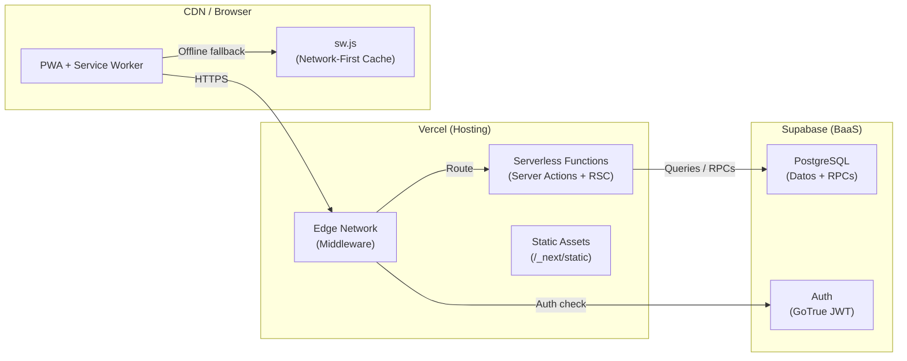

# 🚀 Guía de Despliegue — Las Pipzhas POS

## Tabla de Contenidos

- [Infraestructura Actual](#infraestructura-actual)
- [Variables de Entorno](#variables-de-entorno)
- [Despliegue en Vercel](#despliegue-en-vercel)
- [Configuración de Supabase](#configuración-de-supabase)
- [Migraciones de Base de Datos](#migraciones-de-base-de-datos)
- [PWA y Service Worker en Producción](#pwa-y-service-worker-en-producción)
- [Monitoreo y Observabilidad](#monitoreo-y-observabilidad)
- [Seguridad, Deuda Técnica y Recomendaciones](#seguridad-deuda-técnica-y-recomendaciones)

---

## Infraestructura Actual



### Stack de Producción

| Componente | Servicio | Plan |
|---|---|---|
| **Hosting + Serverless** | Vercel | Hobby (según OIDC token) |
| **Base de Datos** | Supabase (PostgreSQL) | Free / Pro |
| **Autenticación** | Supabase Auth (GoTrue) | Incluido |
| **CDN** | Vercel Edge Network | Incluido |
| **DNS** | Vercel (automático) | Incluido |

### URLs del Proyecto

| Entorno | URL |
|---|---|
| **Producción** | `https://pos-laspipzhas.vercel.app` (estimada por nombre del proyecto Vercel) |
| **Supabase Dashboard** | `https://supabase.com/dashboard/project/zzotuirpqwjobrmlztrg` |
| **Supabase API** | `https://zzotuirpqwjobrmlztrg.supabase.co` |

---

## Variables de Entorno

### Variables Requeridas

| Variable | Ejemplo | Alcance | Descripción |
|---|---|---|---|
| `NEXT_PUBLIC_SUPABASE_URL` | `https://xxx.supabase.co` | Cliente + Servidor | URL del proyecto Supabase |
| `NEXT_PUBLIC_SUPABASE_ANON_KEY` | `sb_publishable_xxx` | Cliente + Servidor | Clave pública anónima de Supabase |

### Variables Opcionales (Generadas por Vercel)

| Variable | Descripción |
|---|---|
| `VERCEL_OIDC_TOKEN` | Token OIDC generado automáticamente por Vercel CLI para integración con servicios externos |

### Configuración por Entorno

#### Desarrollo Local (`.env.local`)

```env
NEXT_PUBLIC_SUPABASE_URL="https://zzotuirpqwjobrmlztrg.supabase.co"
NEXT_PUBLIC_SUPABASE_ANON_KEY="sb_publishable_xxxxx"
```

#### Vercel (Dashboard → Settings → Environment Variables)

Las mismas variables deben configurarse en el dashboard de Vercel:

1. Ir a **Project Settings → Environment Variables**
2. Agregar `NEXT_PUBLIC_SUPABASE_URL` para todos los entornos (Production, Preview, Development)
3. Agregar `NEXT_PUBLIC_SUPABASE_ANON_KEY` para todos los entornos

### ¿Por Qué `NEXT_PUBLIC_`?

El prefijo `NEXT_PUBLIC_` es obligatorio porque las variables se necesitan en:

- **Client Components** (`createBrowserClient` en `src/lib/supabase/client.ts`)
- **Server Components** (`createServerClient` en `src/lib/supabase/server.ts`)
- **Middleware Edge** (`createServerClient` en `src/middleware.ts`)

Sin el prefijo, las variables solo estarían disponibles en el servidor y los Client Components no podrían crear el cliente de Supabase.

> **Seguridad:** La ANON_KEY es una clave pública diseñada para ser expuesta en el frontend. La seguridad se delega a las políticas RLS de PostgreSQL y a las validaciones de los Server Actions.

---

## Despliegue en Vercel

### Despliegue Automático (CI/CD)

Si el repositorio está conectado a Vercel:

1. Cada `push` a `main` dispara un despliegue de producción
2. Cada `push` a otras ramas genera un Preview Deployment
3. Los Pull Requests generan preview URLs automáticas

### Despliegue Manual

```bash
# Instalar Vercel CLI (si no existe)
npm i -g vercel

# Login
vercel login

# Desplegar a producción
vercel --prod
```

### Configuración de Build

Valores del `package.json`:

```json
{
  "scripts": {
    "dev": "next dev",
    "build": "next build --webpack",
    "start": "next start"
  }
}
```

| Parámetro de Vercel | Valor |
|---|---|
| **Framework Preset** | Next.js |
| **Build Command** | `npm run build` |
| **Output Directory** | `.next` (auto-detectado) |
| **Install Command** | `npm install` |
| **Node.js Version** | 20.x (recomendado) |

> **Nota sobre `--webpack`:** El flag `--webpack` fuerza el uso de Webpack en lugar de Turbopack para el build de producción. Esto puede deberse a incompatibilidades con alguna dependencia.

### Funciones Serverless

Las Server Actions se despliegan automáticamente como funciones serverless en Vercel. Cada archivo `'use server'` genera endpoints internos manejados por el framework.

**Regiones:** Por defecto, las funciones se despliegan en `iad1` (Washington, DC). Para reducir latencia con Supabase (cuya región depende de la configuración), considerar configurar la región más cercana.

```json
// vercel.json (si se necesita configurar la región)
{
  "functions": {
    "src/server/**/*.ts": {
      "maxDuration": 10
    }
  }
}
```

---

## Configuración de Supabase

### Proyecto Supabase

| Propiedad | Valor |
|---|---|
| **Project Ref** | `zzotuirpqwjobrmlztrg` |
| **Region** | (verificar en Dashboard) |
| **PostgreSQL Version** | 15+ (Supabase managed) |

### Configuración de Auth

| Setting | Valor Recomendado |
|---|---|
| **Email Confirmations** | **Deshabilitado** (para flujo POS interno) |
| **Password Minimum Length** | 6+ |
| **JWT Expiry** | 3600 seconds (1 hora) |
| **Refresh Token Rotation** | Habilitado |
| **Site URL** | URL de producción (ej: `https://pos-laspipzhas.vercel.app`) |
| **Redirect URLs** | URL de producción + localhost:3000 |

### Tablas y Schema

Las tablas deben existir en el schema `public`. Ver [database.md](./database.md) para definiciones completas.

**Orden de creación:**

```
1. ingredientes          (independiente)
2. tamanos_pizza         (FK → ingredientes.caja_id)
3. recetas_toppings      (FK → ingredientes, tamanos_pizza)
4. sabores               (independiente)
5. sabor_ingredientes    (FK → sabores, ingredientes)
6. historial_inventario  (FK → ingredientes, auth.users)
7. ventas                (FK → auth.users) [vía migración 01_historial_ventas.sql]
```

### Funciones RPC

Ejecutar en el SQL Editor de Supabase en este orden:

```
1. supabase/03_fix_procesar_venta.sql   → procesar_venta (versión final)
2. supabase/02_fix_revertir_venta.sql   → revertir_venta (versión corregida)
3. Crear descontar_ingrediente          → (definición no en repo, ver database.md)
```

> **⚠️ No ejecutar `rpc_procesar_venta.sql` ni `01_historial_ventas.sql` si ya se ejecutó `03_fix_procesar_venta.sql`**: Las versiones posteriores reemplazan las anteriores con `CREATE OR REPLACE`.

---

## Migraciones de Base de Datos

### Estado Actual: Migraciones Manuales

El proyecto **no usa** Supabase CLI ni un sistema de migraciones automatizado. Los cambios de schema se aplican manualmente ejecutando scripts SQL en el Supabase Dashboard.

### Orden Histórico de Migraciones

| # | Archivo | Qué Hace | Notas |
|---|---|---|---|
| 0 | (tablas base) | Crea `ingredientes`, `tamanos_pizza`, etc. | No existe archivo; creadas manualmente |
| 1 | `rpc_procesar_venta.sql` | RPC v1 (solo deduce inventario, sin tabla ventas) | **OBSOLETA** |
| 2 | `01_historial_ventas.sql` | Crea tabla `ventas` + RPC v2 + `revertir_venta` | Agrega RLS en ventas |
| 3 | `02_fix_revertir_venta.sql` | Fix: usa `'ajuste'` en lugar de `'ingreso'` para tipo_movimiento | Parche incremental |
| 4 | `03_fix_procesar_venta.sql` | Fix: deducción completa para pizza de 1 sabor | **Versión activa** |

### Seeds Disponibles

| Archivo | Uso | ⚠️ Destructivo |
|---|---|---|
| `seed.sql` | Datos mínimos de prueba (7 ingredientes) | No |
| `seed_v2.sql` | Datos completos (17 ingredientes, 3 tamaños, recetas) | **SÍ** — ejecuta `TRUNCATE CASCADE` |

### Recomendación: Adoptar Supabase CLI

```bash
# Instalar
npm install supabase --save-dev

# Inicializar
npx supabase init

# Crear migración
npx supabase migration new nombre_descriptivo

# Aplicar migraciones
npx supabase db push
```

Esto permitiría:
- Versionamiento ordenado de cambios de schema
- Reproducibilidad entre entornos
- Rollbacks controlados
- Generación automática de tipos TypeScript

---

## PWA y Service Worker en Producción

### Manifest (`public/manifest.json`)

| Propiedad | Valor |
|---|---|
| `name` | Pipzhas POS |
| `short_name` | PipzhasPOS |
| `start_url` | /pos |
| `display` | standalone |
| `orientation` | portrait-primary |
| `theme_color` | #ea580c |
| `background_color` | #f6f7fa |

**Shortcuts configurados:**
- Nueva Venta → `/pos`
- Historial de Ventas → `/ventas`
- Bodega → `/inventario`

### Service Worker (`public/sw.js`)

| Aspecto | Configuración |
|---|---|
| **Cache Name** | `pipzhas-pos-v1` |
| **Estrategia** | Network-First con fallback a cache |
| **Pre-cache** | `/`, `/pos`, `/offline.html`, `/manifest.json` |
| **Exclusiones** | `supabase.co`, `_next/webpack-hmr`, `__nextjs` |
| **Offline fallback** | `/offline.html` para navegaciones |

### Actualización del Service Worker

Para forzar una actualización del Service Worker en producción:

1. Cambiar `CACHE_NAME` en `sw.js` (ej: `pipzhas-pos-v2`)
2. Desplegar
3. El nuevo SW se instalará automáticamente (`skipWaiting`)
4. Tomará control de todas las pestañas (`clients.claim`)
5. Las cachés antiguas se eliminarán en el evento `activate`

### Iconos PWA

| Tamaño | Propósito |
|---|---|
| 72×72 | Android básico |
| 96×96 | Shortcuts |
| 128×128 | Android medio |
| 144×144 | Splash screen |
| 152×152 | iOS (Apple Touch Icon) |
| 192×192 | Android (maskable) |
| 384×384 | Android grande |
| 512×512 | Android (maskable, splash) |

---

## Monitoreo y Observabilidad

### Estado Actual

La aplicación tiene **observabilidad mínima**:

- `console.error()` en Server Actions para errores de RPC e historial
- `console.log()` / `console.warn()` para eventos PWA
- Toast notifications para feedback al usuario
- No hay integración con servicios de monitoreo (Sentry, Datadog, etc.)

### Recomendaciones de Monitoreo

| Herramienta | Propósito | Prioridad |
|---|---|---|
| **Vercel Analytics** | Performance y Core Web Vitals | 🟢 Gratis con Vercel |
| **Sentry** | Error tracking en Server Actions | 🔴 Alta |
| **Supabase Logs** | Queries lentas y errores de RPC | 🟠 Media |
| **Uptime Robot** | Monitoreo de disponibilidad | 🟢 Gratis |

---

## Seguridad, Deuda Técnica y Recomendaciones

### 🔴 Pre-Despliegue Crítico

#### 1. Verificar `.gitignore` Incluye `.env.local`

El archivo `.env.local` contiene credenciales de Supabase y un token OIDC de Vercel. Verificar que está excluido del repositorio:

```gitignore
# .gitignore
.env.local
.env*.local
```

#### 2. Deshabilitar Confirmación de Email en Supabase

Para un POS interno, la confirmación de email por correo es contraproducente. Deshabilitarla en:

**Supabase Dashboard → Authentication → Providers → Email → Confirm email: OFF**

#### 3. Configurar Site URL en Supabase Auth

Necesario para que los redirects funcionen correctamente en producción:

**Supabase Dashboard → Authentication → URL Configuration → Site URL: `https://tu-dominio.vercel.app`**

### 🟠 Post-Despliegue

| # | Acción | Impacto |
|---|---|---|
| 4 | Habilitar RLS en TODAS las tablas | Seguridad de datos |
| 5 | Configurar región de Vercel Functions cerca de Supabase | Latencia |
| 6 | Configurar headers de seguridad (CSP, HSTS) | Seguridad web |
| 7 | Agregar dominio personalizado | Profesionalismo |
| 8 | Configurar backups automáticos de PostgreSQL | Recuperación ante desastres |
| 9 | Implementar rate limiting en Server Actions | Protección contra abuso |
| 10 | Agregar logging estructurado con correlación de requests | Debugging en producción |

### Checklist de Despliegue

```markdown
- [ ] Variables de entorno configuradas en Vercel
- [ ] Tablas creadas en Supabase
- [ ] RPCs ejecutados (03_fix + 02_fix + descontar_ingrediente)
- [ ] RLS habilitado en tabla ventas
- [ ] Al menos 1 usuario creado en Supabase Auth
- [ ] Seed de datos ejecutado (seed_v2.sql)
- [ ] Confirmación de email deshabilitada
- [ ] Site URL configurada
- [ ] Build exitoso (`npm run build`)
- [ ] Verificar login funcional
- [ ] Verificar flujo completo de venta
- [ ] Verificar Service Worker instalado
```
